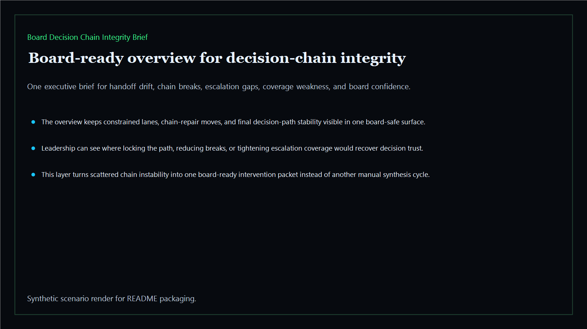
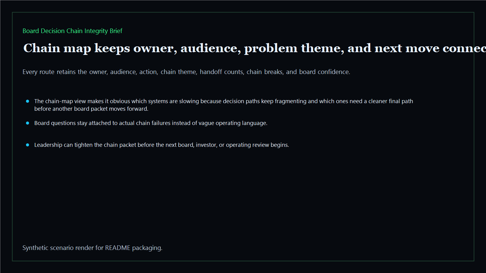
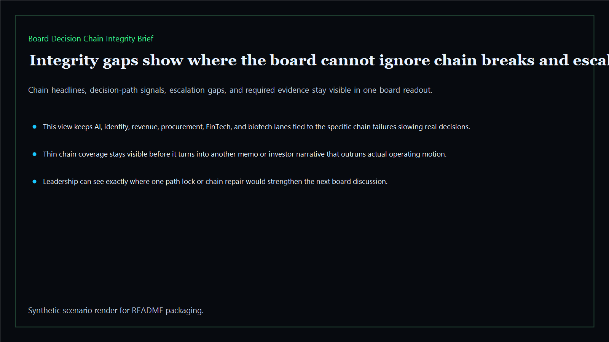
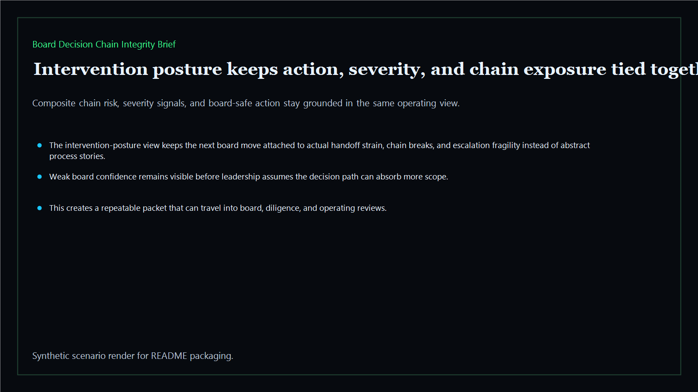

# Board Decision Chain Integrity Brief

Board-ready chain-integrity brief for tracking whether a decision path stays intact, legible, and board-safe across the executive estate.

- Live: `https://integrity.kineticgain.com/`
- Repo: `mizcausevic-dev/board-decision-chain-integrity-brief`

## Why this matters

Leaders need more than named owners. They need one brief that shows where the decision chain itself is intact, where handoffs are breaking, and which lanes are too fragile for another board cycle.

## What it includes

- TypeScript executive-intelligence surface for chain-integrity scoring with modeled executive lanes, handoff drift, integrity thresholds, and board-safe intervention posture
- synthetic executive lanes across AI, identity, revenue, FinTech, biotech, procurement, and public-sector readiness
- reusable outputs for chain-integrity lanes, handoff scorecards, intervention packets, and board-ready operating memos
- prerendered static site, JSON payloads, screenshots, and docs

## Routes

- `/`
- `/chain-map`
- `/integrity-gaps`
- `/intervention-posture`
- `/verification`
- `/docs`

## Local run

```bash
 cd board-decision-chain-integrity-brief
npm install
npm run verify
npm run prerender
npm run render:assets
```

## CLI

```bash
npx board-decision-chain-integrity-brief fixtures/board-decision-chain-integrity-brief.json --format summary
npx board-decision-chain-integrity-brief fixtures/board-decision-chain-integrity-brief-clean.json --format json
```

## Docs

- [Architecture](docs/architecture.md)
- [Origin](docs/ORIGIN.md)
- [Kinetic Gain Embedded](docs/KINETIC_GAIN_EMBEDDED.md)

## Screenshots





